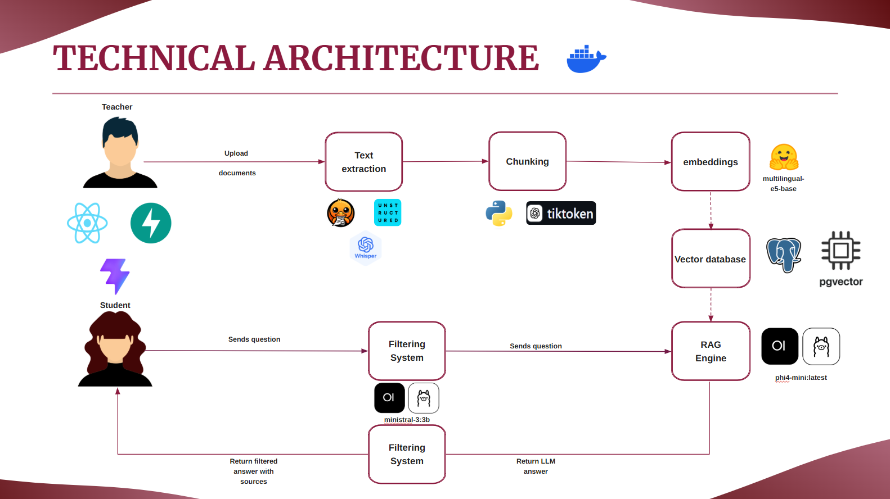
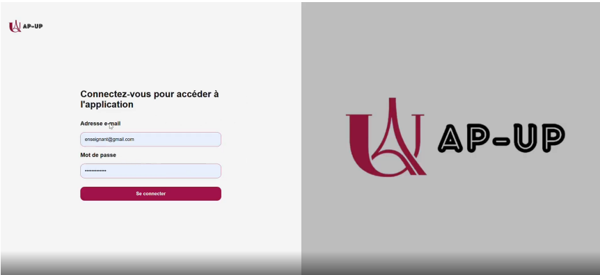
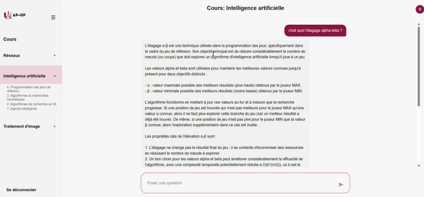
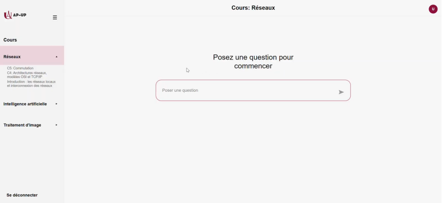
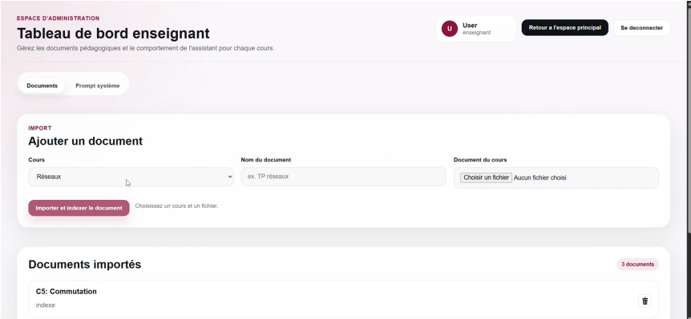
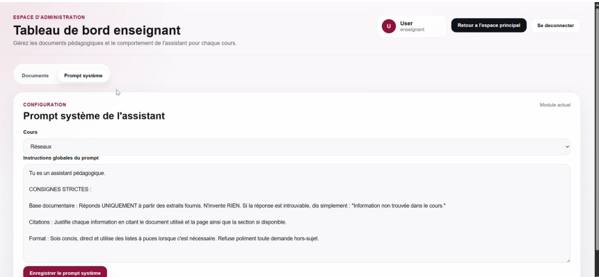
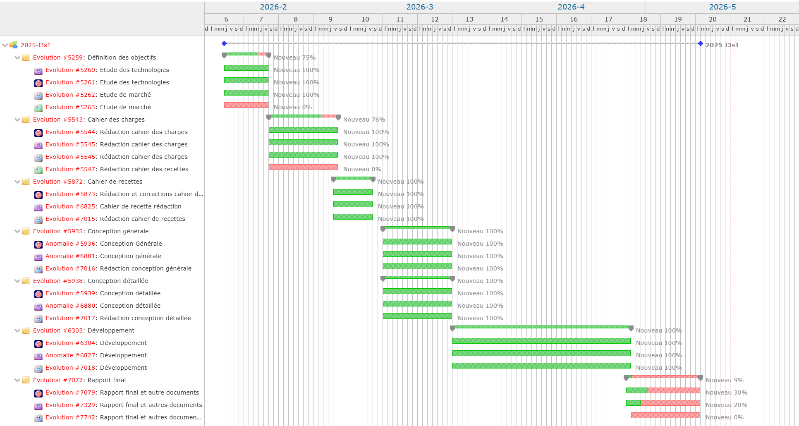

# 🎓 AP-UP : Assistant Pédagogique Université Paris Cité


**AP-UP** est un assistant pédagogique conversationnel local basé sur une architecture RAG (Retrieval-Augmented Generation). Conçu pour les étudiants et les enseignants de l'Université Paris Cité, il permet d'interroger un modèle d'intelligence artificielle qui génère des réponses fiables, sourcées et strictement limitées au périmètre des documents de cours.

Ce projet apporte une solution sécurisée face aux enjeux de propriété intellectuelle et aux « hallucinations » des IA génératives grand public.

--- 

# 🏗️ Technical Architecture 

 

---

# 📸 Aperçu de l'application

## 🔐 Connexion et Espaces Utilisateurs

L'application distingue deux types d'utilisateurs : les étudiants et les enseignants.



---

## 💬 Espace Étudiant (Chat)

L'étudiant peut poser des questions sur un module spécifique et obtenir une réponse détaillée avec la source exacte.



### Interface initiale de l'espace de chat



---

## 👨‍🏫 Espace Enseignant (Administration)

L'enseignant dispose d'un tableau de bord pour importer/indexer des documents (PDF, vidéos, audio) et configurer le prompt système de l'assistant.





---

# ✨ Fonctionnalités Clés

* **Architecture RAG sur mesure :**
  Recherche sémantique avancée dans les cours grâce à une vectorisation du contenu (*embeddings*).

* **Traçabilité des sources :**
  Chaque réponse générée affiche clairement ses références (nom du document, page, section concernée).

* **Filtrage hybride de sécurité :**
  Un système robuste utilisant la similarité cosinus et un SLM (*Small Language Model* — `ministral-3:3b`) agissant comme « juge » pour bloquer les requêtes et réponses hors-sujet.

* **Ingestion multimédia intelligente :**
  Extraction et découpage (*chunking*) adaptés à la complexité des fichiers :

  * PDF simples via `pdfplumber`
  * PDF complexes via `Docling`
  * Audio/Vidéo via `Whisper`

---

# 🛠️ Technologies Utilisées

| Catégorie                   | Technologies                                                   |
| --------------------------- | -------------------------------------------------------------- |
| **Frontend**                | React, Vite, JavaScript                                        |
| **Backend & API**           | Python, FastAPI                                                |
| **Base de données**         | PostgreSQL, `pgvector`, SQLAlchemy (ORM)                       |
| **IA & Inférence**          | Ollama, `sentence-transformers`, `ministral-3:3b`, `phi4-mini` |
| **Traitement documentaire** | Docling, Unstructured, pdfplumber, Whisper                     |

---

# ⚙️ Installation et Déploiement

## 📋 Prérequis

* Docker et Docker Compose
* Client SVN (`TortoiseSVN` ou CLI)
* **Réseau :** accès au réseau interne de l'université (Pléiade) requis pour l'inférence des modèles de langage locaux

---

## 🚀 Lancement de l'application

### 1. Cloner le projet depuis la forge de l'université

```bash
svn checkout https://forge.ens.math-info.univ-paris5.fr/svn/2025-l3s1/tags/<version>
```

---

### 2. Lancer les conteneurs Docker

À la racine du projet :

```bash
docker compose up --build
```

Cette commande démarre :

* PostgreSQL → `localhost:5432`
* API FastAPI → `localhost:8000`
* Frontend React → `localhost:5173`

---

### 3. Accéder à l'application

```txt
http://localhost:5173/
```

---

### ⚠️ Important

Voir le fichier :

```txt
Manuel_Installation_L3S.pdf
```

pour les instructions détaillées concernant :

* la configuration PostgreSQL
* la création d'utilisateurs de test
* l'utilisation de `pgcrypto`

---

# 🧪 Tests et Robustesse

La fiabilité de l'application est assurée par une couverture de tests complète :

* tests fonctionnels
* tests d'intégration
* tests unitaires

---

## ✅ Modules Ingestion & Filtrage

Validés avec le framework `pytest` :

* normalisation
* chunking
* validation SLM

---

## ✅ Module RAG

Testé en isolation avec `unittest` en utilisant des objets *mocks* pour simuler les dépendances externes.

---

# 📅 Suivi de Projet

L'organisation et la planification du projet sur 12 semaines ont été pilotées à l'aide d'un diagramme de Gantt.



---

# 👥 Équipe Projet

Projet réalisé par le **Groupe L3S (Licence 3 Informatique)** — Université Paris Cité.

---

